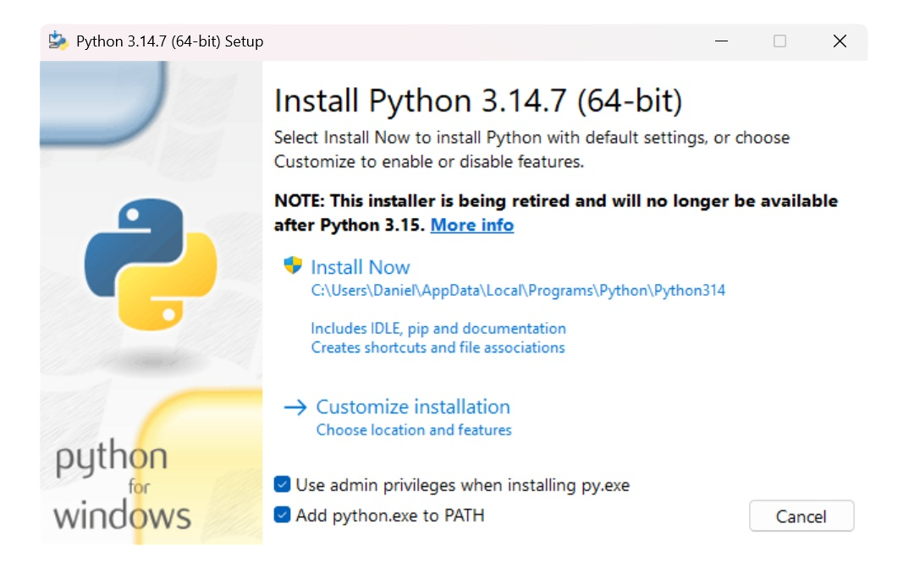

# Instalación

Garúa puede instalarse como herramienta CLI y como servidor MCP. La instalación base es la misma; lo que cambia es cómo lo conectas a tu flujo de trabajo.

## Requisitos

- Python 3.11+; se recomienda usar una versión reciente de [Python].
- Windows, macOS o Linux.
- Acceso a internet para instalar el paquete y descargar datos desde SENAMHI.
- [Google Chrome], Brave o Microsoft Edge instalado. Garúa usa un navegador local
  compatible con Chromium para consultar SENAMHI y descargar datos.
- Un cliente MCP si quieres usar Garúa desde un asistente de IA compatible.

??? tip "Instalar Python en Windows"
    Si vas a instalar Python desde [python.org], activa la casilla **Add python.exe to PATH**
    en la primera pantalla del instalador antes de seleccionar **Install Now**. Así podrás
    ejecutar `python`, `pip` y `garua` directamente desde la terminal.

    

    Si necesitas una guía visual, sigue el video [Cómo instalar Python en Windows y añadirlo al PATH](https://youtu.be/BfiQ8feXCOI).

[Python]: https://www.python.org/downloads/
[python.org]: https://www.python.org/downloads/
[Google Chrome]: https://www.google.com/intl/es_es/chrome/safety/

??? info "Navegador local basado en Chromium"
    Garúa intenta detectar el navegador automáticamente. Primero usa la detección de
    zendriver para Google Chrome o Brave; en Windows también puede usar Microsoft
    Edge como navegador compatible.

    Si quieres indicar una ruta manualmente, define `GARUA_BROWSER_PATH` con la ruta
    completa al ejecutable:

    ```powershell
    $env:GARUA_BROWSER_PATH = "C:\Program Files\Google\Chrome\Application\chrome.exe"
    ```

    Para más detalles, revisa [Variables de entorno](reference/environment.md#uso-comun){data-preview}.

## Instalar Garúa desde PyPI

Garúa se publica en [PyPI](https://pypi.org/project/garua/). Puedes instalarlo con `pip` o con `pipx`.

Usa `pip` si ya trabajas con entornos de Python o quieres instalar Garúa dentro de un proyecto. Usa `pipx` si quieres usar Garúa como herramienta de terminal, especialmente en Windows o cuando prefieres no ajustar manualmente el `PATH`.

Si usas Windows y tienes poca experiencia con la terminal, puedes abrir **CMD**
desde el menú Inicio: escribe `cmd` o **Símbolo del sistema** en el buscador y
abre la aplicación **Símbolo del sistema**. Luego ejecuta allí el comando de
instalación; no lo escribas en el navegador ni en el buscador de Windows.

También puedes seguir el video [Instalación y uso de Garúa](https://www.youtube.com/watch?v=q5I_q8GrOZ0&t=418s),
que muestra este proceso paso a paso.

=== ":simple-python: pip"

    ```bash
    pip install garua
    ```

    Verifica la instalación:

    ```bash
    garua --help
    ```

    También puedes ejecutarlo como módulo:

    ```bash
    python -m garua
    ```

    ??? question "¿El comando `garua` no aparece en la terminal en Windows?"

        En Windows, esto suele ocurrir cuando la carpeta `Scripts` de Python no está agregada al `PATH`.

        Para ubicar la carpeta de scripts del usuario, ejecuta:

        ```powershell
        python -m site --user-base
        ```

        Luego agrega la subcarpeta `Scripts` al `PATH`. Por ejemplo, si el comando anterior devuelve:
        
        ```text
        C:\Users\TuUsuario\AppData\Roaming\Python
        ```

        * Nota: `TuUsuario` es tu nombre de usuario en Windows

        La ruta completa que debes agregar sería:

        ```text
        C:\Users\TuUsuario\AppData\Roaming\Python\Scripts
        ```

        Después de actualizar el `PATH`, cierra y vuelve a abrir la terminal.

        Para ver el procedimiento completo, sigue el video [Cómo añadir la carpeta Scripts de Python al PATH en Windows](https://youtu.be/IXkccLZaHmA).

=== ":simple-pipx: pipx"

    !!! info "Instalar pipx"

        Si aún no tienes `pipx`, instálalo primero:

        ```bash
        py -m pip install --user pipx
        py -m pipx ensurepath
        ```

    Luego instala Garúa:

    ```bash
    pipx install garua
    ```

    `pipx` instala Garúa en un entorno aislado y expone los comandos `garua` y `garua-mcp` como ejecutables.

Verifica que los comandos estén disponibles:

```bash
garua --help
garua --health
garua-mcp
```

`garua --health` revisa los requisitos básicos: versión de Python, sistema
operativo, directorios de salida y navegador disponible. También puedes usar el
alias `garua --health`.

## Actualizar Garúa

Usa el mismo gestor con el que instalaste Garúa.

=== ":simple-python: pip"

    ```bash
    python -m pip install --upgrade garua
    ```

    Si instalaste Garúa dentro de un entorno virtual, activa ese entorno antes de
    actualizar.

=== ":simple-pipx: pipx"

    ```bash
    pipx upgrade garua
    ```

    Si administras varias herramientas con `pipx`, también puedes actualizar todas:

    ```bash
    pipx upgrade-all
    ```

Después de actualizar, valida la versión y el entorno:

```bash
garua --version
garua --health
```

Si usas Garúa como servidor MCP, reinicia el cliente donde lo tengas configurado
para que cargue el ejecutable actualizado.

## Instalar para desarrollo

Usa esta opción si quieres modificar el código fuente, probar cambios locales o contribuir al proyecto.

```bash
git clone https://github.com/danyneyra/garua.git
cd garua
python -m venv .venv
.venv\Scripts\activate
pip install -e ".[dev]"
```

En Linux o macOS:

```bash
source .venv/bin/activate
```

## Configurar MCP

Garúa funciona como servidor MCP local por `stdio`. La forma más simple es usar el comando instalado:

```bash
garua-mcp
```

!!! warning "No se encuentra **garua-mcp**"

    Si el cliente no encuentra `garua-mcp`, usa una ruta absoluta al ejecutable o al Python de tu entorno virtual, por ejemplo:

    ```text
    D:\garua\.venv\Scripts\python.exe -m garua_mcp
    ```

=== ":material-microsoft-visual-studio-code: VS Code"

    VS Code puede configurar servidores MCP en el perfil de usuario o en el workspace. Para compartir la configuración con un equipo, usa `.vscode/mcp.json` dentro del proyecto. Para uso personal, abre la configuración desde la paleta de comandos con `MCP: Open User Configuration`.

    Ejemplo recomendado para `.vscode/mcp.json`:

    ```json
    {
      "servers": {
        "garua": {
          "type": "stdio",
          "command": "garua-mcp"
        }
      }
    }
    ```

    Si usas entorno virtual:

    ```json hl_lines="5"
    {
      "servers": {
        "garua": {
          "type": "stdio",
          "command": "D:\\garua\\.venv\\Scripts\\python.exe", // (1)!
          "args": ["-m", "garua_mcp"]
        }
      }
    }
    ```

    1.  Aquí debe ir la ruta de Python instalado en tu sistema o de tu entorno virtual.

    Recomendaciones:

    - Usa configuración de usuario si Garúa estará disponible en todos tus proyectos.
    - Usa `.vscode/mcp.json` si quieres que el proyecto documente o comparta su servidor MCP.
    - Revisa el panel de MCP Servers en VS Code para iniciar, detener o ver logs del servidor.
    - Para más detalles, revisa la [documentación oficial de VS Code](https://code.visualstudio.com/docs/agent-customization/mcp-servers).

=== ":fontawesome-brands-openai: Codex"

    Codex registra servidores MCP desde su archivo `config.toml`.

    Configuración sugerida:

    ```toml
    [mcp_servers.garua]
    enabled = true
    command = 'garua-mcp'
    ```

    Usa `enabled = true` cuando quieras dejar Garúa activo por defecto.

    Si usas entorno virtual:

    ```toml hl_lines="3"
    [mcp_servers.garua]
    enabled = false
    command = 'D:\garua\.venv\Scripts\python.exe' # (1)!
    args = ['-m', 'garua_mcp']
    ```

    1.  Aquí debe ir la ruta de Python instalado en tu sistema o de tu entorno virtual.

    Puedes descargarlo desde la web oficial de [Codex](https://openai.com/es-419/codex/)

    Recomendaciones:

    - Reinicia Codex después de editar el archivo (cierra desde la barra de tareas y vuelve a abrirlo).
    - Mantén `enabled = false` si solo quieres activarlo cuando lo necesites.
    - Usa `enabled = true` si Garúa será parte habitual de tu flujo con datos SENAMHI.
    - Prefiere rutas absolutas cuando Codex no herede el mismo `PATH` de tu terminal.
    - Para más información, revisa la [documentación oficial de Codex](https://developers.openai.com/codex/mcp).

=== ":fontawesome-brands-claude: Claude Desktop"

    Claude Desktop usa `claude_desktop_config.json`.

    Ubicaciones comunes:

    - Windows: `%APPDATA%\Claude\claude_desktop_config.json`
    - macOS: `~/Library/Application Support/Claude/claude_desktop_config.json`
    - Linux: `~/.config/Claude/claude_desktop_config.json`

    Configuración recomendada:

    ```json
    {
      "mcpServers": {
        "garua": {
          "command": "garua-mcp"
        }
      }
    }
    ```

    Si usas entorno virtual:

    ```json hl_lines="4"
    {
      "mcpServers": {
        "garua": {
          "command": "D:\\garua\\.venv\\Scripts\\python.exe", // (1)!
          "args": ["-m", "garua_mcp"]
        }
      }
    }
    ```

    1.  Aquí debe ir la ruta de Python instalado en tu sistema o de tu entorno virtual.

    Puedes descargarlo desde la web oficial de [Claude Desktop](https://claude.com/download).

    
    Recomendaciones:

    - Reinicia Claude Desktop después de editar el archivo.
    - Si Claude no detecta Garúa, usa rutas absolutas.
    - Evita configurar servidores MCP que no conoces o no confías.
    - Para más información, revisa la [documentación oficial de Claude](https://code.claude.com/docs/en/mcp#plugin-provided-mcp-servers).

=== ":lucide-settings: Otros"

    Muchos clientes compatibles usan una variante de configuración con nombre del servidor, comando y argumentos.

    Configuración base:

    ```json
    {
      "mcpServers": {
        "garua": {
          "command": "garua-mcp"
        }
      }
    }
    ```

    Si el cliente usa el formato de VS Code, cambia `mcpServers` por `servers` y agrega `type: "stdio"`.

    Recomendaciones:

    - Confirma si tu cliente espera JSON, TOML o configuración desde interfaz gráfica.
    - Usa `garua-mcp` si instalaste desde PyPI.
    - Usa `python -m garua_mcp` si el cliente no hereda el mismo `PATH`.
    - `python -m garua.mcp_server` también funciona como ruta interna del paquete.
    - Reinicia el cliente después de cambiar la configuración.

## Validar la instalación

Después de instalar Garúa, ejecuta:

```bash
garua --doctor
```

Si el diagnóstico marca el navegador como `OK`, las descargas pueden abrir el
navegador local cuando lo necesiten.

Cuando el servidor MCP esté conectado, prueba una consulta desde tu cliente:

```text
¿Cuántas estaciones SENAMHI tienes disponibles?
Busca estaciones llamadas Cabana
```

Si el cliente responde usando Garúa, la instalación está lista.

## Problemas comunes

- Si `garua` no existe, revisa que el directorio de scripts de Python esté en el `PATH` o usa `python -m garua`.
- Si el cliente MCP no encuentra el comando, usa la ruta absoluta al ejecutable o al Python del entorno virtual.
- Si `garua --doctor` no encuentra navegador, instala Google Chrome o Brave. En Windows también puedes usar Microsoft Edge.
- Si tienes un navegador instalado en una ruta no estándar, configura `GARUA_BROWSER_PATH` con la ruta completa del ejecutable.
- Si la descarga falla por red o cambios del sitio de SENAMHI, vuelve a intentar y revisa si hay incidencias abiertas en el repositorio.
